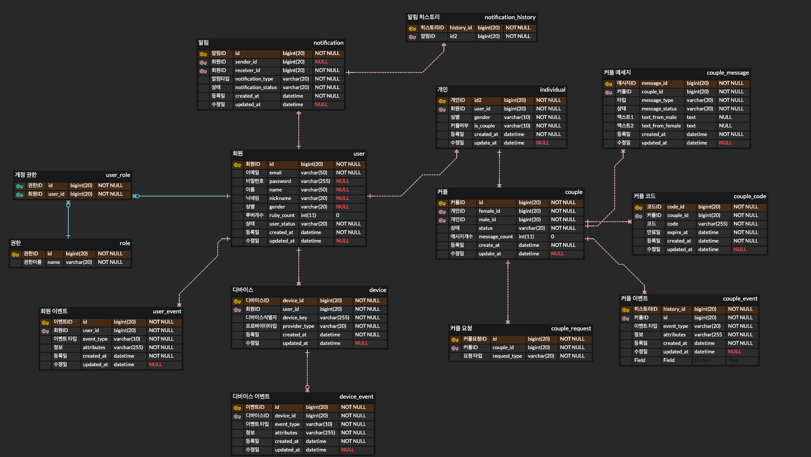

# haru

커플 간의 메세지를 공유하는 서비스입니다. 멀티모듈을 이용해 MSA 환경을 구축했습니다. 
서비스 구성은 핵심 비즈니스(api-core), 프론트(api-core), 알림/노티(api-notification)으로 구성되어있습니다. 

모든 서비스는 기본적으로 Hexagonal Architecture로 구현하고, 일부 서비스에서는 Event Sourcing, CQRS 패턴이 적용되어 있습니다.

## 📖 ERD

